# Raspberrypi,ステガノグラフィ,イーサリアムを用いてHello World

## setup
```
git clone https://github.com/tyukei/GanbaruHackthon_2024.git
python3 -m venv venv
source venv/bin/activate
python app.py
```


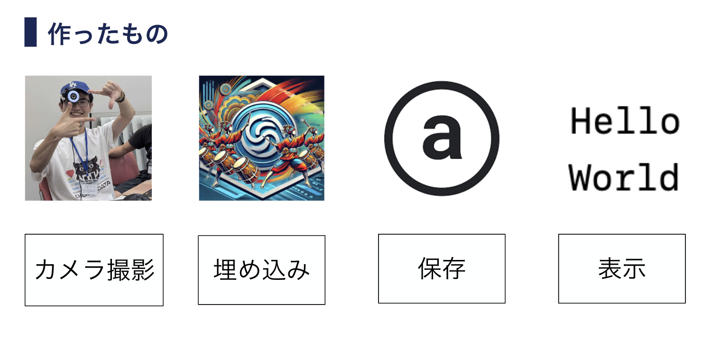

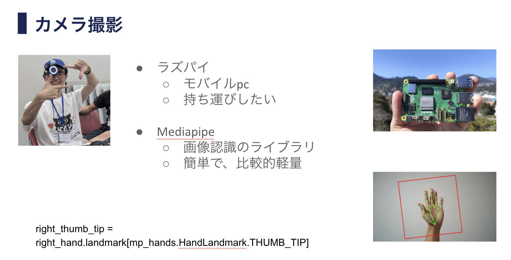

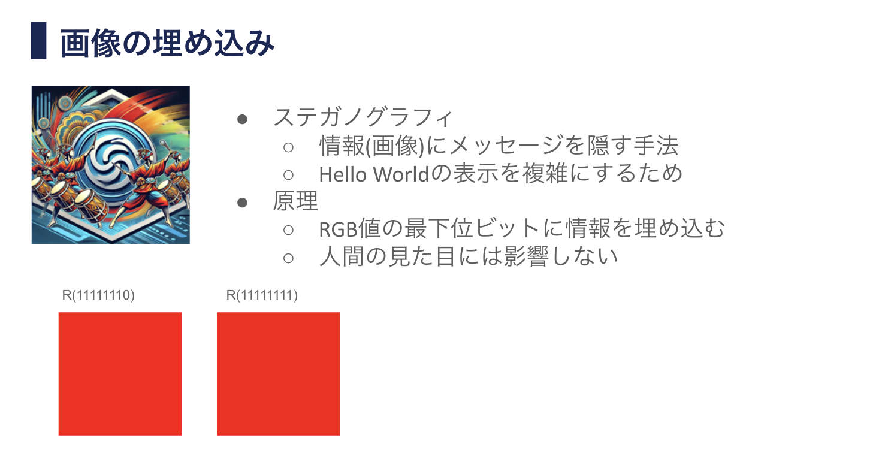

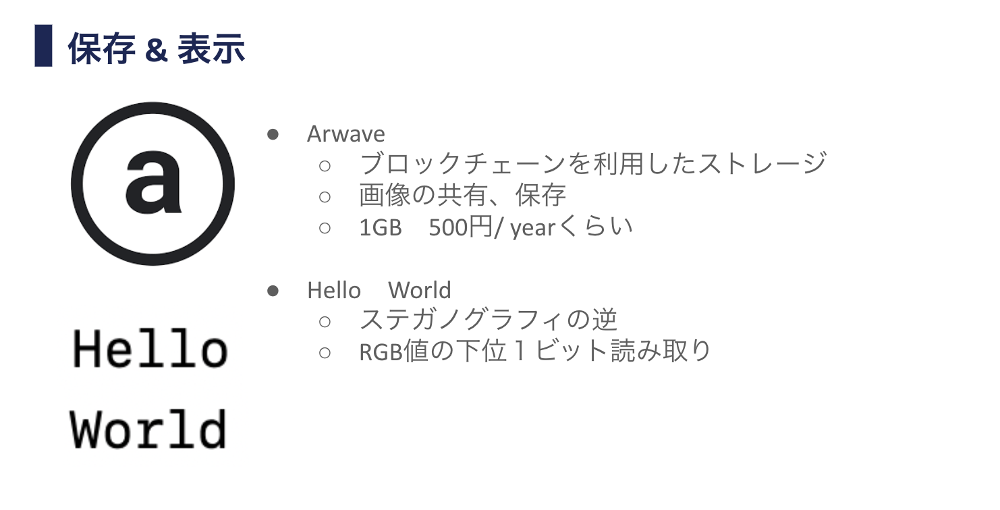


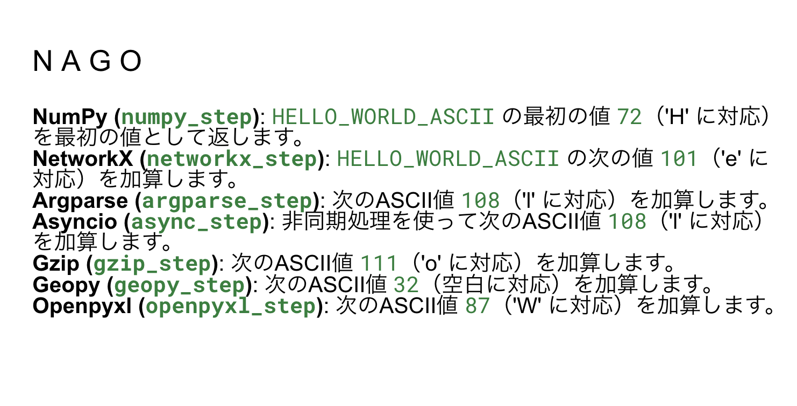

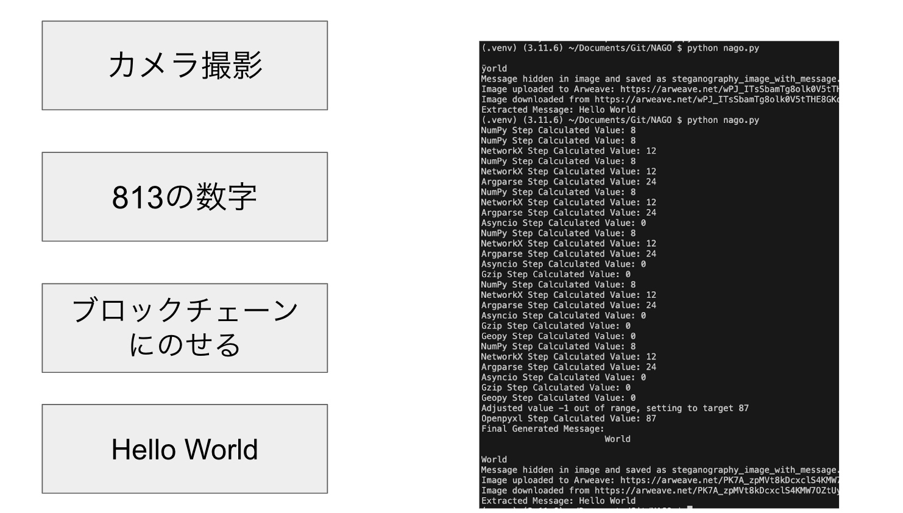

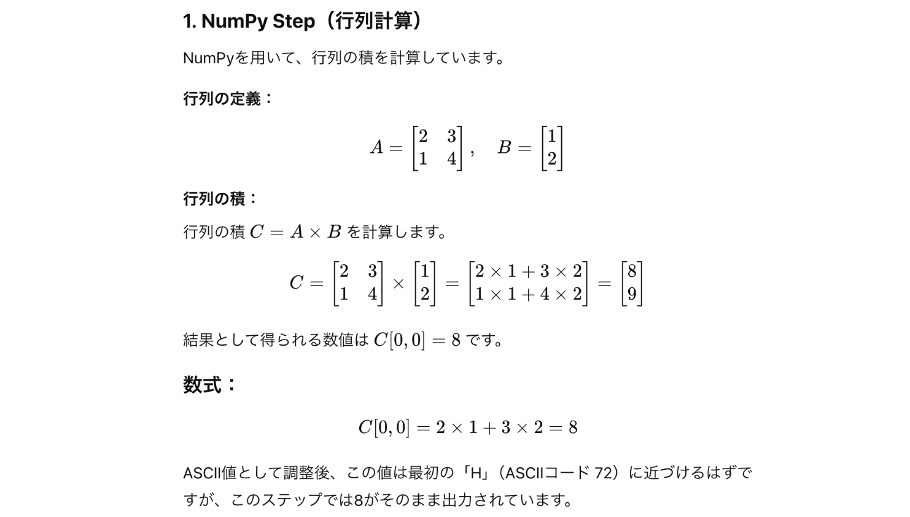

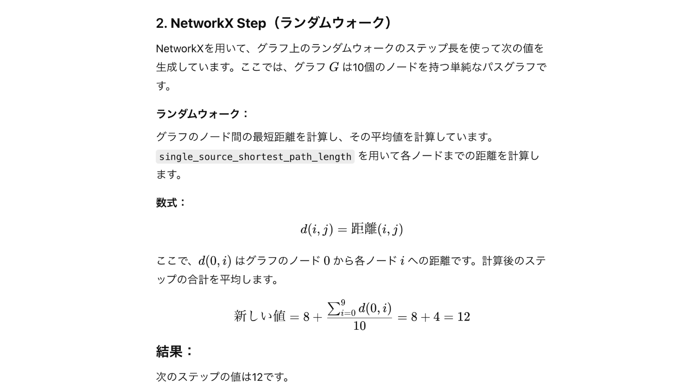

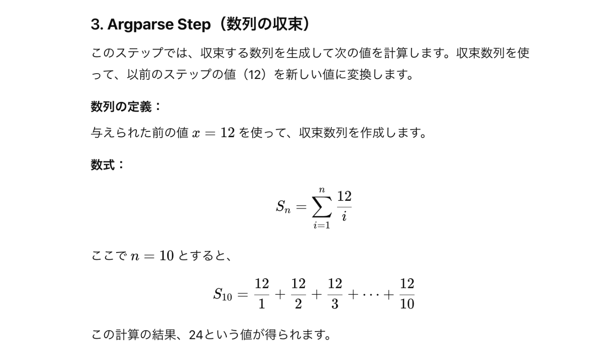

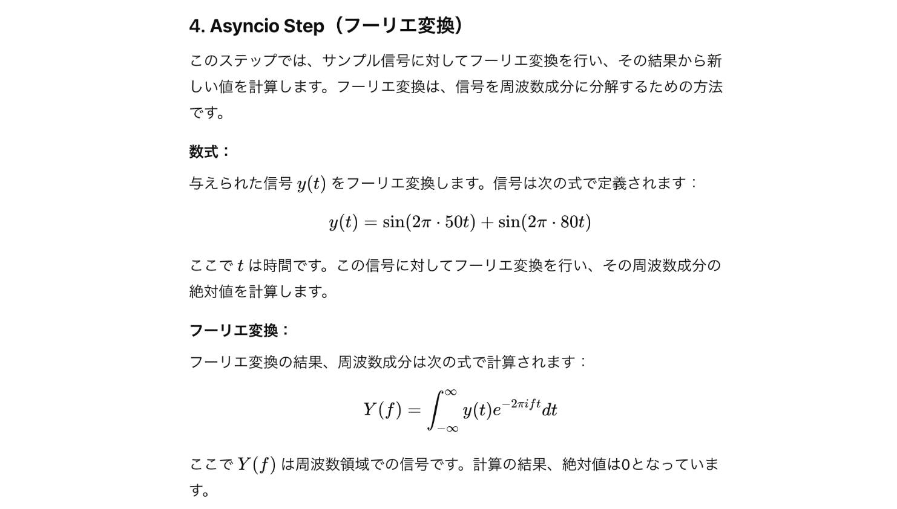

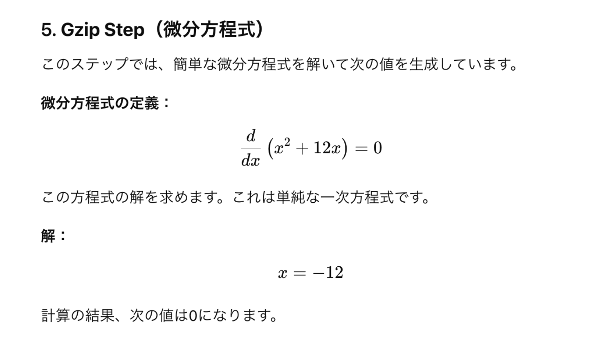

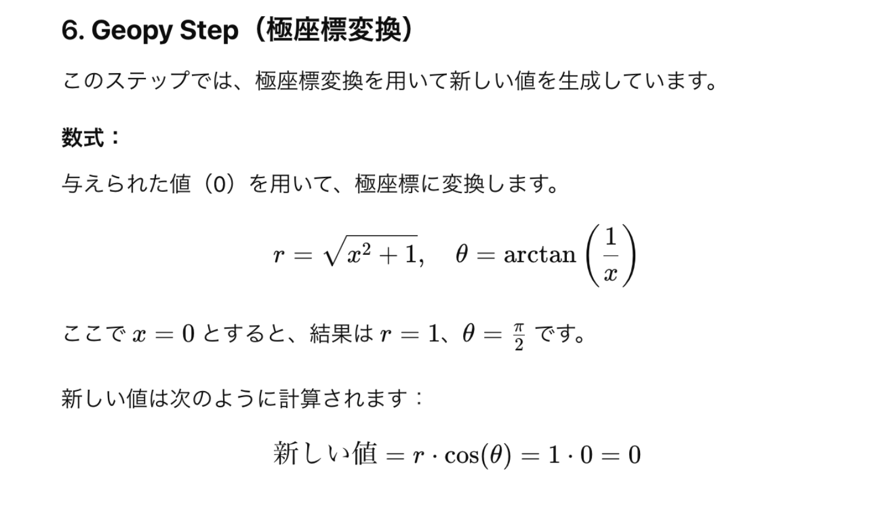

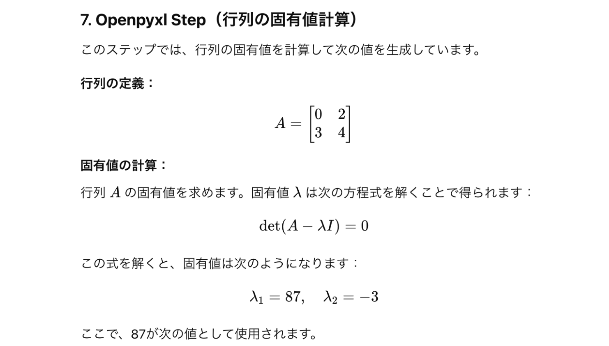

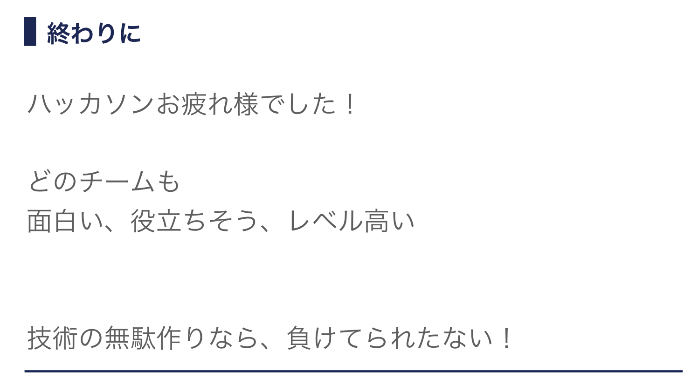


